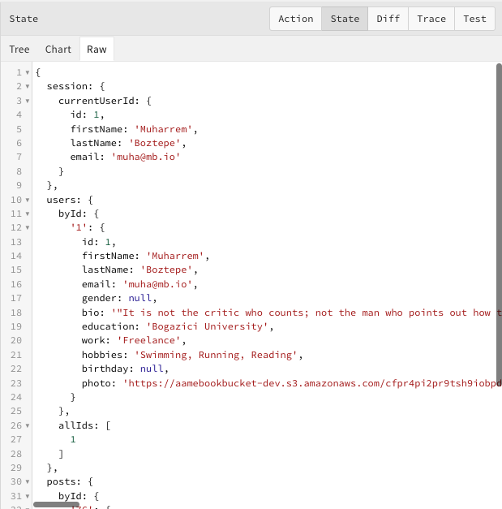
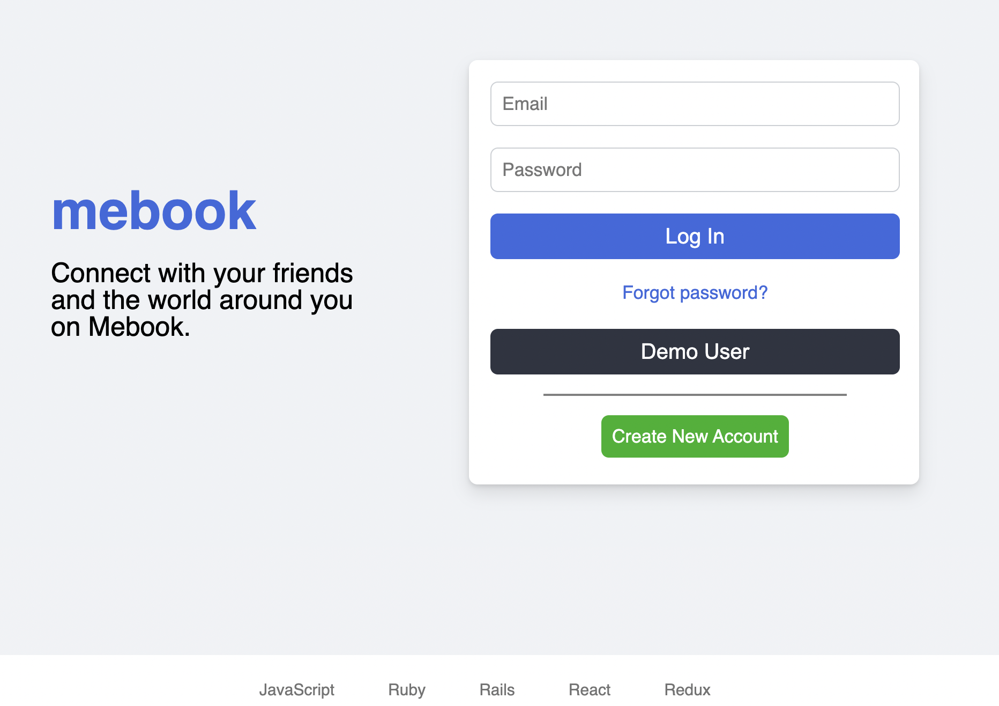
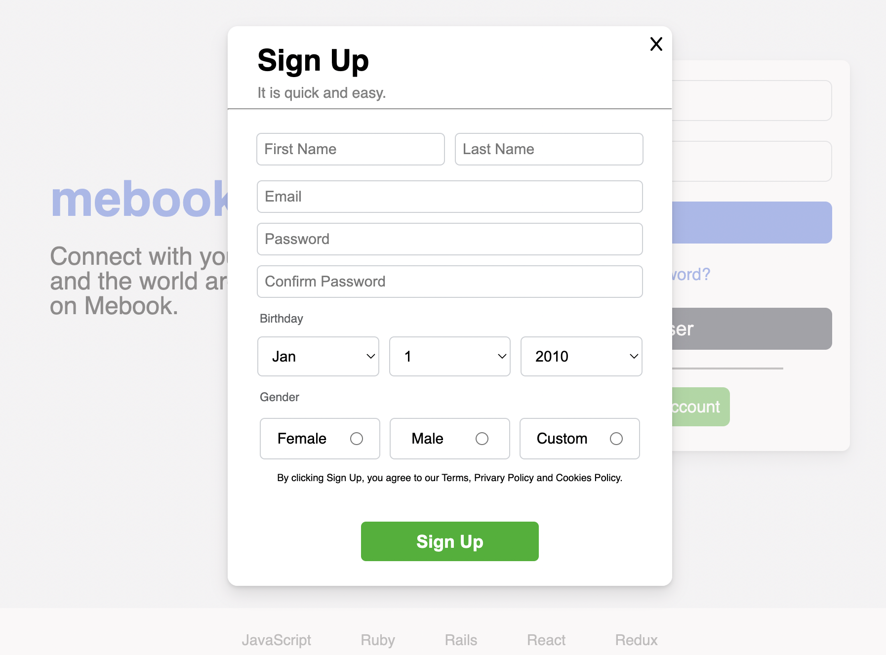
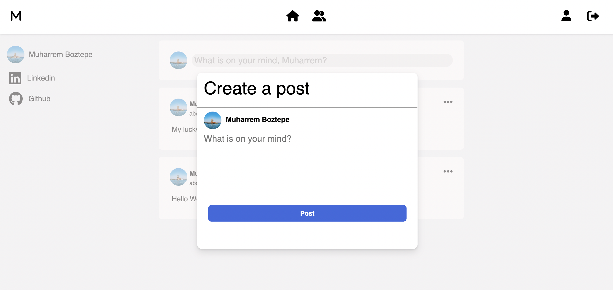
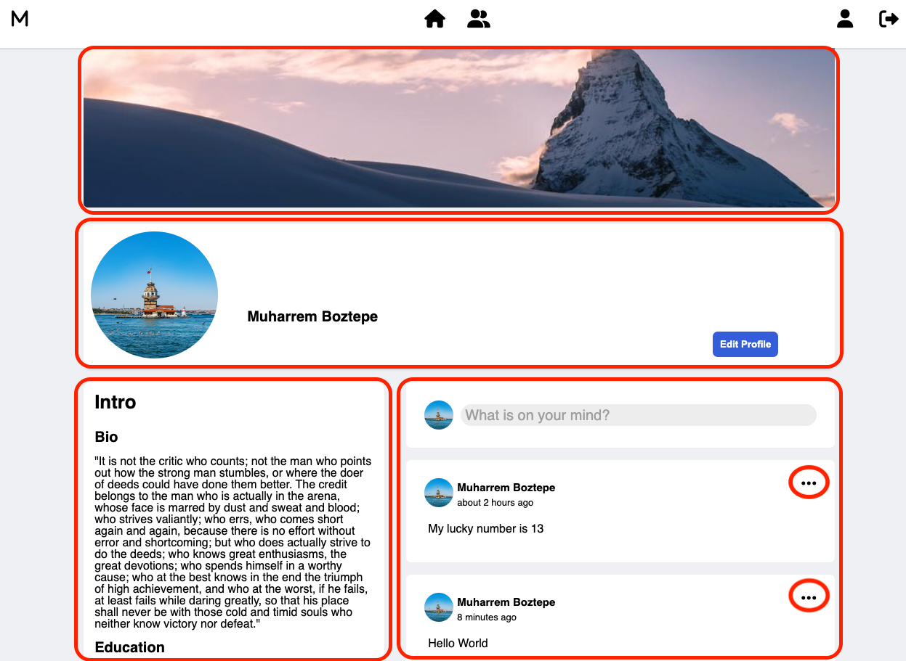
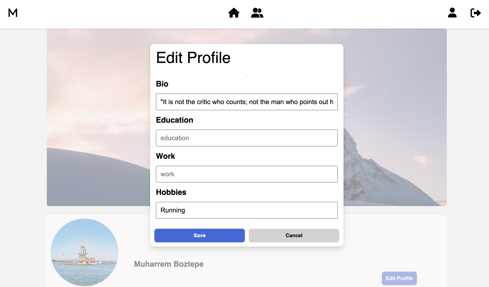

# MEBOOK


Mebook is a social media platform that users can post on their own pages and interact with their friends. It is a Facebook clone. 

Live Link [Mebook](https://mebook-2022.herokuapp.com/)

# Technology
Mebook backend stack is on Ruby and Rails. Javascript, React and Redux are used for front end. 

# Design Decisions

## Redux State
There are three main slices in the Redux store; session, users and posts. For users and posts, I divided slice of state into two keys; byId and allIds. allIds is an array of ids. The main reason to have such an array is to indicate ordering when needed.



## Modal Components
There are many modals in Facebook platform. In Mebook, modals are used for open sign up, create post and edit post functions. The modals implemented using Portals(to render children into a node that outside of the hierarchy of the parent component) and useContext hook(to access the main modal through all components). 

This approach enables to convert forms/divs into modal as wrapping target component with main modal component. 

```javascript
export const EditPostModal = ({onClose, postId, userProfile}) => {
    return (
        <Modal onClose={() => onClose(false)}>
            <EditPostForm postId={postId} onClose={onClose} userProfile={userProfile}/>
        </Modal>
    )
}
```

# Features 
- User Authentication & Login. User can create a new account by clicking Create New Account button and is automaticaly directed to main page. User can also check demo user button for a quick look into the platform. 

## Login Page


## Signup Page


## User Feeds Page
- User Feeds Page. When user logs in, directed to feeds page. User can post here by clicking "What is on your mind, 'UserFirstName'?" button. Create a post window is designed as a modal.



## User Profile Page
- User Profile Page. User can access to profile page by clicking profile icon in the feeds page. The profile page has a cover image, profile photo, user info and user post sections.



Edit Profile button opens a new modal for user to edit intro section. 



When user clicks on three dots in the post section, it opens a dropdown list that user can either edit or delete the post. The edit post button opens up a new modal on the screen. 